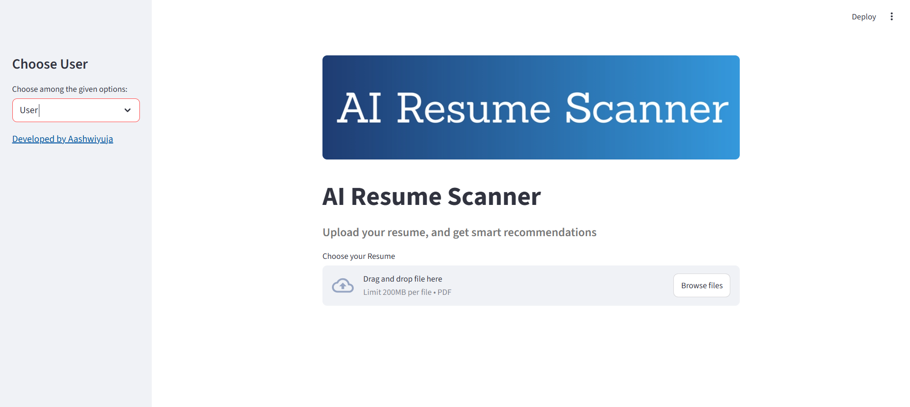
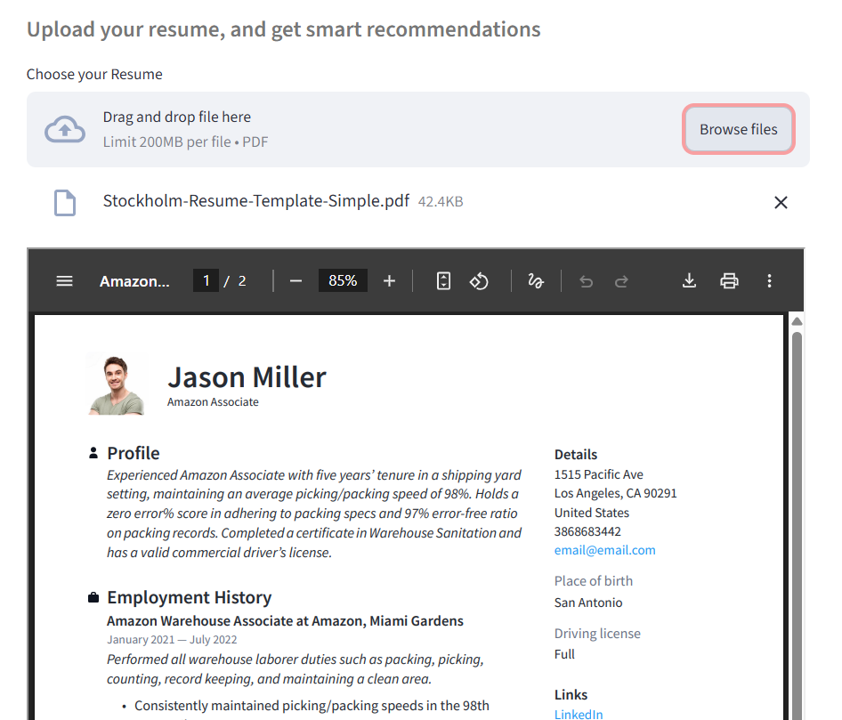
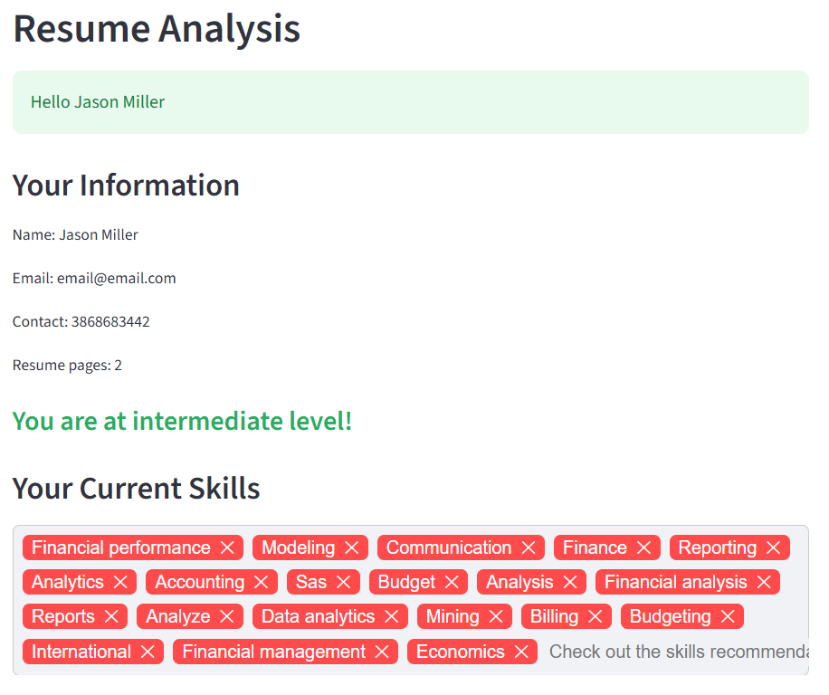
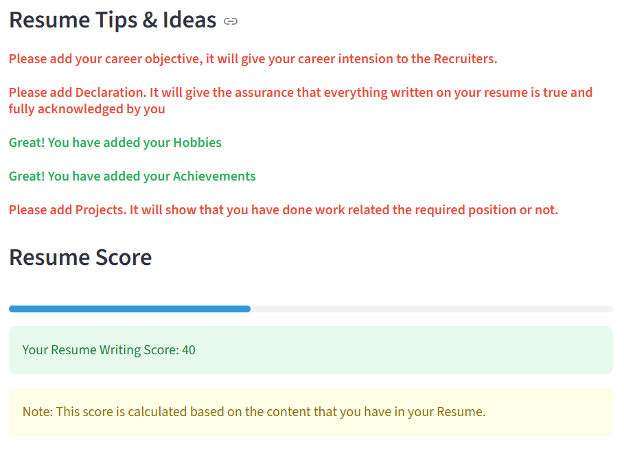
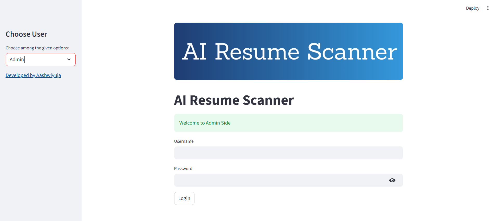
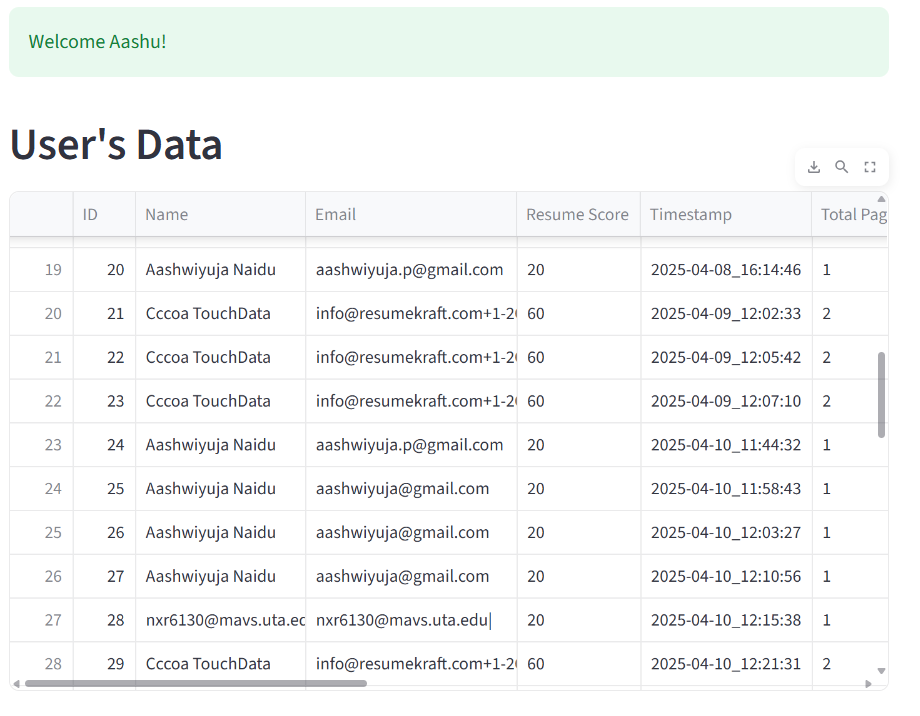
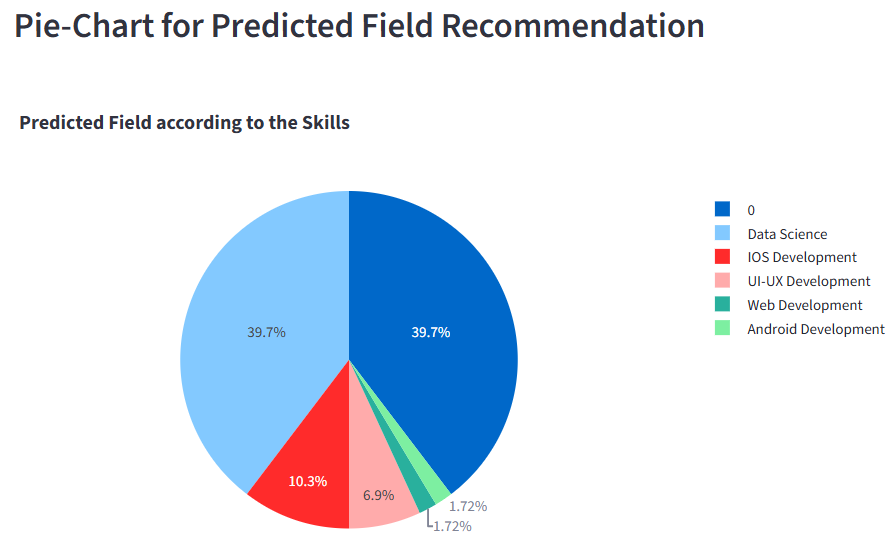
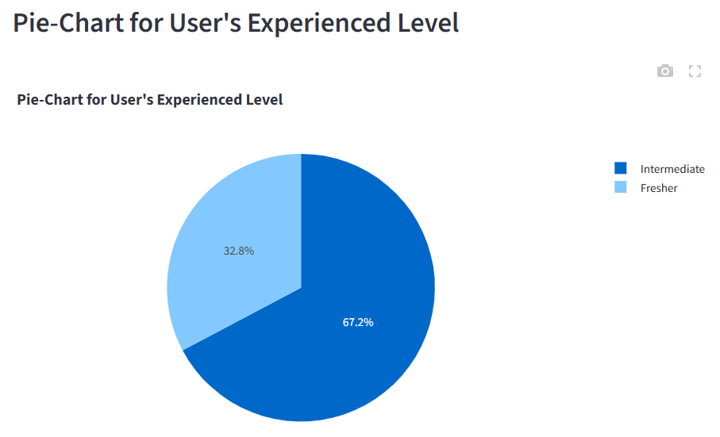

# AI Resume Scanner

## Problem Statement
In today’s competitive job market, candidates often struggle to understand how their resumes align with industry expectations. Many are unsure which skills to highlight or what courses to pursue to improve their chances. Recruiters, on the other hand, face the challenge of quickly evaluating resumes at scale. This project was born to bridge that gap by using AI to help candidates enhance their resumes and guide them toward relevant learning paths.

## App Screenshots

<h3>Resume Upload Flow</h3>

  
  
  
  

<h3>Admin Dashboard</h3>
 
  
  
  

## Strategies Tried

### Core Features
- **Resume Upload**: Users can upload resumes in PDF or text format.
- **Skills Extraction**: NLP libraries like spaCy and NLTK identify key skills from the resume.
- **Job Field Prediction**: The system predicts suitable job domains based on extracted skills.
- **Skill Recommendations**: Suggests additional skills to strengthen the resume.
- **Course Recommendations**: Recommends online courses or certifications to help users upskill.

### NLP Pipeline
1. **Text Preprocessing**  
   - Extracted resume text using PyPDF2.  
   - Cleaned text by removing stop words and unnecessary characters.

2. **Skill Extraction**  
   - Tokenized text using spaCy.  
   - Matched entities against predefined skill lists for fields like Data Science, Web Development, and Android Development.

3. **Job Field Prediction**  
   - Mapped extracted skills to job domains using keyword matching.

4. **Recommendations**  
   - Suggested additional skills to enhance the resume.  
   - Recommended courses dynamically using Streamlit’s slider widget.

### Deployment & Interface
- Built with **Python** and deployed using **Streamlit**.
- Used **Pandas** for data handling and **Plotly** for interactive visualizations.
- Added basic **user authentication** for admin access.
- Styled the app with custom CSS and supported both light and dark modes.

### Base64 Integration
- Used Python’s `base64` library to encode/decode binary data (e.g., images, files) for secure transmission in text-based formats like JSON or HTML.

## What We Aim to Achieve
- **Smarter Recommendations**: Integrate real-time job market data to suggest trending skills and courses.
- **User Profiles**: Allow users to save progress and track learning paths.
- **Resume Scoring**: Provide a score or feedback on resume quality.
- **Multilingual Support**: Enable resume analysis in multiple languages.
- **Advanced Authentication**: Implement OAuth or similar for secure login.
- **Cloud Deployment**: Host the app on platforms like Heroku, AWS, or Azure for scalability.

## Observations from the Project
- **NLP is powerful** but requires careful tuning to extract meaningful insights.
- **User experience matters**  Streamlit helped build a clean, intuitive interface.
- **Randomized suggestions** are helpful but could be improved with personalization.
- **Data quality is key** resumes vary widely in format and content, so preprocessing is crucial.

## Recommendations & Improvements
- **Improve Skill Matching**: Use semantic similarity or embeddings for better accuracy.
- **Course Integration**: Link directly to platforms like Coursera, Udemy, or LinkedIn Learning.
- **Feedback Loop**: Let users rate suggestions to improve the model over time.
- **Security & Privacy**: Ensure uploaded resumes are handled securely and deleted after processing.
- **Expand Dataset**: Train models on a larger, more diverse set of resumes for better accuracy.
